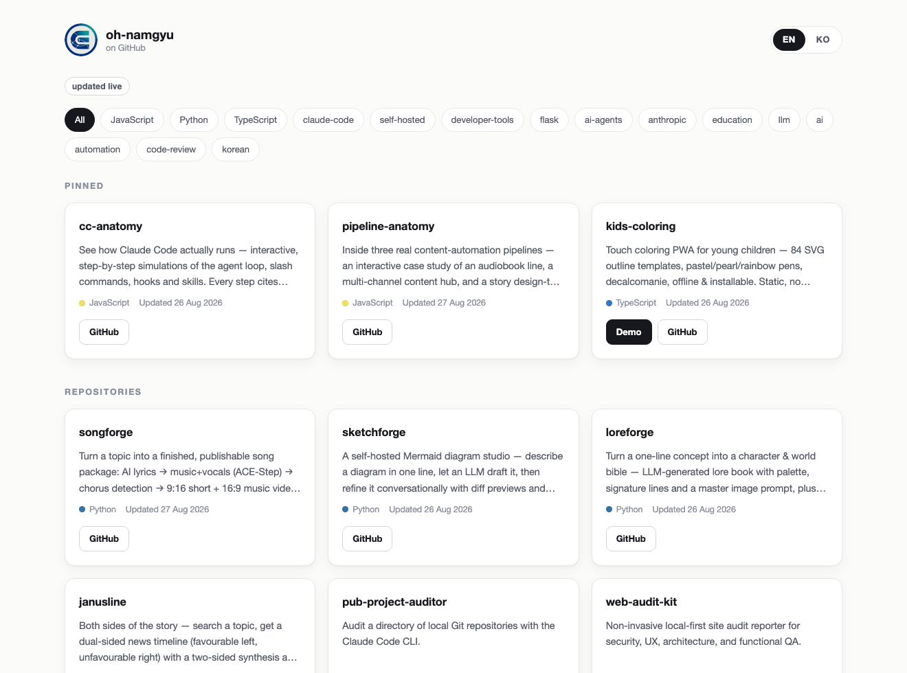
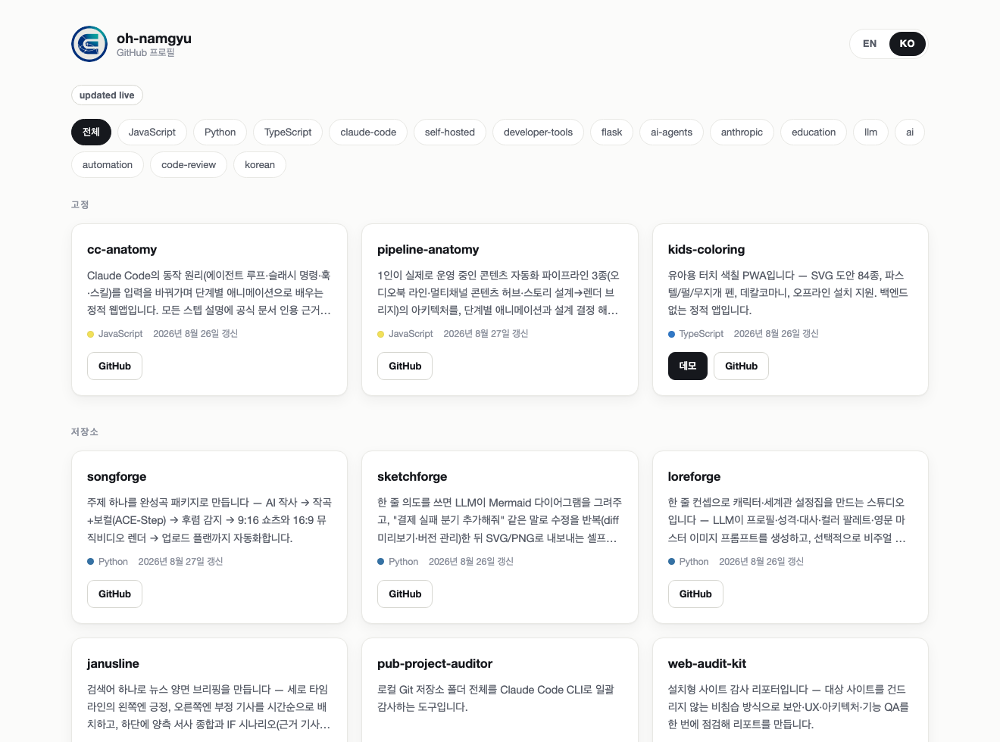

# showfolio (한국어)

[](https://github.com/oh-namgyu/showfolio/actions/workflows/ci.yml)
[](LICENSE)
[](#개발)

*(English: [README.md](README.md))*

한 번만 배포해 두는 GitHub 계정용 포트폴리오 페이지입니다.

**새 공개 repo 를 만들면 그대로 페이지에 올라옵니다 — 다시 빌드할 필요도, 재배포할
필요도, 어딘가를 고칠 필요도 없습니다.** 그리드는 방문자가 페이지를 여는 그 시점에
브라우저에서 GitHub API 로 읽어옵니다. 그래서 이 페이지는 계정의 오래된 사본이 아니라
계정을 바라보는 창입니다. 사용자가 바꾸는 것은 계정명 한 줄뿐입니다.

각 카드에는 repo 이름, 설명, 언어, 스타 수, 마지막 push 시각, homepage 가 설정돼 있으면
**데모** 버튼, 그리고 코드 링크가 들어갑니다. 카드 설명은 두 언어로 볼 수 있습니다 —
영어는 GitHub description 에서, 한국어는 각 repo 의 README 에서 파싱한 요약 블록에서
가져옵니다([규약 설명](#한글-요약-규약)).

정적 사이트입니다. 빌드 단계 없음, 서버 없음, API 키 없음, 계정 없음, 런타임 의존성
없음.

---

## 스크린샷

| 영어 — GitHub description | 한국어 — 각 README 에서 파싱한 요약 |
| :--- | :--- |
|  |  |

두 이미지 모두 `node scripts/shots.mjs` 산출물입니다. 커밋된 스냅샷 데이터로 Chromium 을
구동해 찍기 때문에, 손으로 다시 캡처하는 대신 언제든 재생성할 수 있습니다.

---

## 내 계정으로 쓰기

네 단계이고, 그중 필수는 두 번째 하나입니다.

**1. 이 저장소를 fork** 합니다(clone 도 무방합니다 — fork 관계에 의존하는 코드는
없습니다).

**2. `js/config.js` 를 편집**합니다. 사용자가 건드리는 유일한 파일이고, 반드시 채워야 하는
값은 `username` 하나입니다.

```js
export const config = {
  username: 'your-github-handle',   // 필수 — 나머지는 전부 선택
  exclude: ['dotfiles'],            // 숨길 repo 이름 (fork·archived 는 자동 제외)
  pinned: ['my-best-project'],      // 그리드 위 고정 구획, 이 순서 그대로
  demoOverrides: {},                // GitHub `homepage` 를 못 쓰는 repo 의 데모 URL
};
```

**3. 스냅샷을 처리**합니다 — `data/snapshot.json` 은 첫 화면을 그리는 오프라인 사본이고,
지금은 원저자의 repo 목록이 들어 있습니다. 둘 중 하나를 고르면 됩니다.

```bash
npm run snapshot      # 내 계정 기준으로 data/snapshot.json 재생성 — 커밋할 것
# 또는
rm data/snapshot.json # 스냅샷 없이: 스켈레톤을 띄우고 라이브로 바로 불러옵니다
```

어느 쪽이든 맞습니다. 남의 스냅샷을 그대로 두는 것은 셋째 선택지가 아니지만, 그렇다고
장애가 되지도 않습니다. 앱이 `snapshot.username` 과 `config.username` 을 비교해 다르면
스냅샷을 무시하고 라이브로 직행하므로, 이 단계를 잊어도 남의 repo 가 보이는 일은
없습니다.

**4. 폴더를 배포**합니다. Vercel·Netlify·GitHub Pages·Cloudflare Pages·S3·nginx 등 정적
호스팅이면 무엇이든 됩니다. 빌드할 것이 없습니다. `vercel.json` 에는 보안 헤더가 이미
설정돼 있고, 다른 호스팅을 쓴다면 같은 헤더를 그쪽 방식으로 지정하면 됩니다.

---

## 불러오는 순서

부팅 순서는 구현 세부가 아니라 **계약**이고, e2e 스위트가 이를 검증합니다.

```
1. 스냅샷        data/snapshot.json  →  그리드 완성          (same-origin 만)
2. 라이브 갱신    api.github.com      →  그리드 교체, "실시간 갱신됨" 뱃지
3. 지연 README   api.github.com      →  한글 요약, 뷰포트 진입 시
4. 캐시          localStorage, 1시간  →  재방문 시 2·3단계 생략
```

**1단계가 완전히 끝난 뒤에야 2단계가 시작됩니다.** 따라서 첫 페인트에 드는 제3자 요청은
0건입니다. 방문자는 same-origin JSON 파일만으로 전체 그리드를 보고, 그 다음에야 페이지가
GitHub 에 접속합니다. 이 순서는 주석이 아니라 브라우저의 요청 로그로 e2e 에서 확인합니다.

**요청 예산.** GitHub API 는 익명 호출자에게 IP 당 시간당 60회를 허용하고, 이 한도는
방문자가 열어 둔 모든 사이트가 나눠 씁니다. 그래서 showfolio 는 **세션당 22회**를 코드
차원에서 스스로 상한으로 둡니다.

| | 상한 | 이유 |
| :--- | :-- | :--- |
| repo 목록 | 2 | `per_page=100` + `Link: next` 1페이지 — 200개 커버 |
| README | 20 | 한국어 모드에서, 스크롤이 닿은 카드에 대해서만 지연 로딩 |
| **세션 합계** | **22** | 카운터가 초과 요청을 로컬에서 거부 |

예산을 넘으면 클라이언트는 커넥션을 열기 전에 예외를 던집니다. 다른 사이트에서 방문자의
한도가 소진되는 원인이 showfolio 일 수는 없습니다.

**실패했을 때.** 모든 실패 경로가 빈 화면보다 나은 곳에 도착합니다.

| 상황 | 방문자가 보는 것 |
| :--- | :--- |
| rate limit (403 + `X-RateLimit-Remaining: 0`) | 스냅샷 또는 캐시 그리드 + 시간당 한도 안내 |
| 네트워크 불통 | 동일 + "GitHub에 연결하지 못했습니다" 안내 |
| 스냅샷 부재·손상·다른 계정 | 조용히 건너뛰고 스켈레톤과 함께 라이브 로드 |
| 둘 다 실패 — 저장본도 없고 라이브도 안 됨 | 설명 문구와 GitHub 프로필 링크. 빈 화면은 없음 |
| 한글 요약이 없는 repo | 두 모드 모두 영어 description 표시 |

---

## 한글 요약 규약

반드시 따라야 하는 기능이 아니라 **문서화된 관례**입니다. 다만 이중 언어 README 를
쓴다면 showfolio 가 무엇을 찾는지 알아 둘 만합니다.

repo 의 `README.md` 상단에 blockquote 한 줄을 둡니다.

```markdown
> **한글 요약** — 한 문단 설명. *(전체 한국어 문서: [README_KOR.md](README_KOR.md))*
```

showfolio 는 GitHub 의 `/readme` 엔드포인트(파일명이 무엇이든 찾아 줍니다)로 README 를
받아, 첫 번째 해당 blockquote 를 뽑고, 마크다운 장식과 끝의 "전체 한국어 문서" 괄호를
제거한 뒤 500자로 잘라 카드의 한국어 텍스트로 씁니다. 해당 블록이 없는 repo 는 GitHub
description 으로 폴백하므로, 계정 안에서 규약이 섞여 있어도 문제없습니다.

파서는 실제로 사람들이 쓰는 변형을 허용합니다 — `**한글 요약**`, `__한글 요약__`, 그냥
`한글 요약`; 구분자 `—`·`–`·`-`·`:` 또는 구분자 없음; 같은 blockquote 안의 여러 줄;
끝의 링크 괄호 생략. 그 밖의 형태는 오류가 아니라 "없음"으로 처리합니다.

**다른 언어로 바꾸려면** `js/summary.js` 의 한 줄만 고치면 됩니다 — 헤딩 패턴이 정규식
하나입니다. 이 규약이 쓸모 있는 이유는 특정 문구 때문이 아닙니다. **요약이 그 요약이
설명하는 repo 안에 산다**는 것, 그래서 프로젝트를 고치는 자리에서 같이 고쳐지고 프로젝트가
바뀌어도 갱신할 두 번째 장소가 생기지 않는다는 것이 핵심입니다.

---

## 유사 도구

showfolio 는 GitHub 계정으로 포트폴리오를 만드는 최초의 도구가 아니고, 그렇게 주장하지도
않습니다. 날짜와 출처를 붙인 전체 조사는
[docs/SIMILAR-TOOLS.md](docs/SIMILAR-TOOLS.md) 에 있습니다. 요약하면:

| 프로젝트 | 빌드 단계 | 재빌드 없이 새 repo 반영 | 상태 |
| :--- | :--- | :--- | :--- |
| [gitfolio](https://github.com/imfunniee/gitfolio) | 있음 — npm CLI 가 데이터를 구워 넣음 | 안 됨 | 2022년 이후 archived |
| [GitProfile](https://github.com/arifszn/gitprofile) | 있음 — Vite/React 빌드 | 됨 — 클라이언트에서 fetch | 활발히 유지보수 |
| **showfolio** | 없음 | 됨 | 이 저장소 |

[github-profile-readme-generator](https://github.com/rahuldkjain/github-profile-readme-generator)
같은 프로필 README 생성기는 인접하지만 **다른 범주**입니다. 호스팅되는 사이트가 아니라
프로필 README 용 마크다운을 뽑아 주는 도구입니다.

조사한 도구 중에는 **repo README 를 파싱해 요약을 만드는 것도, 이중 언어 카드를 내는
것도, 오프라인 데이터 스냅샷을 폴백으로 두는 것도 없었습니다.** 이는 특정 날짜에 특정
프로젝트 넷을 조사한 결과일 뿐, 존재하는 모든 도구에 대한 주장이 아닙니다. 위 세 가지보다
테마·통계 카드·블로그 섹션이 더 중요하다면 GitProfile 이 더 나은 선택이며 지금도 활발히
유지보수되고 있습니다.

---

## 보안

전문은 [SECURITY.md](SECURITY.md) 입니다. 배포 전에 알아 둘 부분만 옮기면:

**수집하는 데이터 없음.** 애널리틱스·텔레메트리·쿠키·오류 리포팅 전부 없습니다.
`localStorage` 에는 캐시된 repo 목록과 EN/KO 선택만 `showfolio:` 접두어 키로 저장되고,
브라우저 밖으로 나가는 것은 없습니다.

**CSP 예외는 두 개, 그게 전부입니다.** 기본 정책은 `default-src 'self'` 이고 예외는:

- **`connect-src https://api.github.com`** — repo 목록과 README 본문. README 는
  `raw.githubusercontent.com` 이 아니라 REST `/readme` 엔드포인트에
  `Accept: application/vnd.github.raw` 로 요청합니다. **이 예외를 두 호스트가 아닌 한
  호스트로 유지하려는 목적** 때문입니다.
- **`img-src https://avatars.githubusercontent.com`** — 헤더의 계정 아바타 하나뿐입니다.
  요청이 실패하면 이미지가 스스로 숨습니다.

`script-src` 와 `style-src` 는 `'self'` 그대로입니다. 인라인 스크립트도 인라인 스타일도
없으므로, 주입된 제3자 리소스는 실행되는 대신 로드에 실패합니다. 같은 정책이 두 곳에
있습니다 — `index.html` 의 `<meta>` 태그와 `vercel.json` 의 실제 응답 헤더 — 그리고 둘은
동일하게 유지됩니다.

**네트워크에서 온 것은 전부 텍스트입니다.** description·한글 요약·repo 이름·토픽·언어명은
모두 `textContent` 로 씁니다. `innerHTML` 에 대입하는 코드는 없습니다. API 응답은 필드
화이트리스트로 하나씩 복사하므로 GitHub 이 새 필드를 추가해도 DOM 에 닿지 않습니다.
데모·GitHub 링크는 URL 로 파싱한 뒤 스킴이 `http:`/`https:` 가 아니면 거부합니다.
`javascript:` homepage 에서 버튼이 아예 그려지지 않는 이유입니다.

---

## 개발

```bash
npm ci                              # dev 의존성: @playwright/test 하나
npm run serve                       # 6186 포트 python3 정적 서버
npm test                            # node --test — 단위 57개
npx playwright install chromium     # 최초 1회
npx playwright test                 # e2e — chromium 47개
npm run snapshot                    # data/snapshot.json 재생성
node scripts/shots.mjs              # 위 스크린샷 재생성
```

`index.html` 을 파일로 직접 열면 **동작하지 않습니다.** ES 모듈이라 브라우저가 `file://`
에서 로드를 거부합니다. 정적 서버면 무엇이든 됩니다.

**두 스위트 모두 완전 모킹이라 CI 는 GitHub API 데이터 호출을 0건 합니다.** 단위
스위트는 클라이언트에 가짜 `fetch` 를 주입하고, e2e 는 Playwright route 로
`api.github.com` 을 가로채 픽스처로 응답합니다. 그래서 매 push 마다 전체를 돌려도
안전하고(GitHub Actions IP 와 공유되는 rate limit 은 테스트가 의존할 만한 대상이
아닙니다), 실패 경로를 검증할 수 있는 유일한 방법이기도 합니다 — GitHub 에 403 을 달라고
요청할 수는 없으니까요. 모킹이 증명하지 못하는 단 하나는 실제 API 가 여전히 우리가
매핑하는 형태를 돌려주느냐인데, 이는 같은 매핑 코드를 쓰는 `npm run snapshot` 을 실제
API 에 대고 돌리는 것으로 확인합니다.

런타임 의존성은 없습니다. `js/` 에서 읽는 코드가 브라우저가 실행하는 코드 전부입니다.

기여 규약과 병합 조건은 [CONTRIBUTING.md](CONTRIBUTING.md) 를 참고하세요.

---

## 라이선스

[MIT](LICENSE) © 2026 oh-namgyu.
